
<link href="https://cdn.bootcss.com/limonte-sweetalert2/8.11.8/sweetalert2.min.css" rel="stylesheet">

# 清华学生的一天是怎样的？学霸果然和我们不一样

相信大家很好奇，清华学生的一天是怎样的？今天，小编就来带大家一起看一看。

来自福建省的陈亮舟同学是一位大二的学生。今天，他 6 点钟就起床了。尽管昨天晚上参加了一场代码军队 (CodeForces) 的比赛，但他仍然坚持了早睡早起的习惯。当问到昨晚的比赛如何时，陈亮舟说：“再黑屁禁言。”事实上，陈亮舟已经在这个网站中获得了“国际宗师”的称号。他向记者透露，他目前的目标是成为一名传奇宗师。全球仅有数十人达到这个层级，而陈亮舟很快就会成为他们的一员。下图是他的比赛记录，可以看出明显的上升趋势。

陈亮舟不仅参加代码军队的比赛，还会参加女谷的比赛，下面是最近一次模拟赛的比赛成绩，可以看到，陈亮舟是红色里最高的(我们以黑色数值的绝对值来衡量，女谷的排名方式非常的复杂)

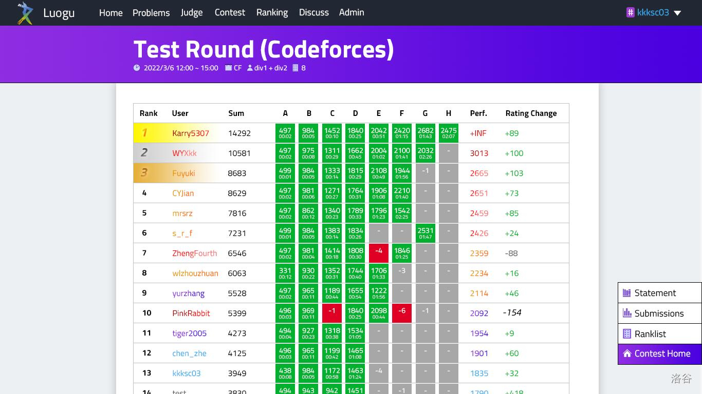

起床后，陈亮舟便开启了他一天的学习。陈亮舟的课选得很满，从早八点开始一直到中午。在上课的期间，他不忘去自动售货机买了一瓶他最爱的康师傅冰红茶。

在被问到后续的目标时，陈亮舟称自己正在进行 RCPC 系列比赛（即Rabbit CPC)的训练，他说：“我的目标是马踏哈尔科夫，手刃优姆尼克”。优姆尼克是上一届的世界总冠军，陈亮舟这样说，是表达了他获得全球冠军的决心。陈亮舟的目标一直很高远，在高中期间，他就发出了“马踏常州，手刃亮舟（一位信竞国家集训队成员）”的誓言。在最终的全国决赛中，他和亮舟同分打平，都入选了国家集训队。

在结束一天的课程以后，陈亮舟没有回到寝室，而是来到了图书馆。他说：“图书馆很安静，学习氛围也比较好，很适合我直播。”粉兔会吹水到图书馆闭馆为止。离开图书馆，他回到了寝室。但这并不是他一天学习的结束。今晚没有比赛要打，陈亮舟会直播写作业。通常，陈亮舟会对直播间里的弹幕进行细致的回复。有次弹幕指出了他抽代作业做错了，他想了 5 分钟，又讲了一种错法，以供观众们引以为戒。

陈亮舟在每天学习之余，还会帮助他的同学解决难题。他也是个心直口快的人，不会回避问题。小 E（化名）某一天找到陈亮舟，说最近的作业很难。陈亮舟直言不讳地指出了问题：“有没有这样一种可能是你太菜了。”陈亮舟说这话是有底气的，他自己的作业完成得相当精彩。

陈亮舟写作业是严谨的。他会使用标准的 $ra^B_tEx$ 书写作业，题目也抄得详尽。他认为写作业而不能理解得透彻，这样的学习是无效的。事实上也确实如此，有一次他写抽代作业时遇到了困难。他花了十余分钟阅读讲稿，还请教了同学，最终才写下了结论：“操……”。

陈亮舟在完成一天的学习后，就会去洗澡。很多时候他学得太晚，甚至水都要停了。他甚至总结出了规律：“水会在十二点过几分才停。而且不是一下停，是慢慢变小。”他几分钟就可以洗完澡，这是为了更早睡觉，准备第二天的早八。虽然洗澡很快，但陈亮舟很爱干净。在一个由学生组成的论坛中，他曾透露了自己的择偶条件：“操我要洗澡”。

陈亮舟所在的班级叫做人工智能实验班。人工智能通俗地来讲就是我们平时说的机器人，或者叫博特。在闲暇的时候，陈亮舟会与算法机器人一起参加比赛。大部分时候，他的成绩都要略逊于机器人。但他很高兴，“我从博特的身上看到了未来”。

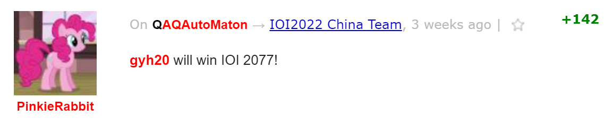

“清华的食堂怎么样呢？”当被问到这个问题的时候，陈亮舟露出了自豪的神情。他说清华的饭都非常好吃，使他养成了按时三餐的习惯。当时针指向 7 点，就到了他吃饭的时候。他通常会点一份外卖，吃一顿丰盛的午饭，来为自己接下来一天的午饭补充能量。

陈亮舟做作业效率很高，因此，他在完成作业时，还不忘为其他同学辅导。

有一次他写作业时，有同学问了他一个物理学上的问题。陈亮舟并不是物理专业，但他学识渊博，因此他耐心解答了这位同学的问题。解答完后，他对这位同学的学习给出了建议：“重修弯曲时空下的电磁场”。尽管花费了时间去解答了问题，陈亮舟的作业效率也很高。有些同学两个多小时需要两门作业，而对陈亮舟来说，抽代作业就够了。

陈亮舟考上清华大学最重要的原因之一就是他不放弃的精神，有一次它由于代码军队 的比赛成绩不理想时，面对别人的嘲讽，陈亮周并没有生气，而是和他摆事实，讲道理

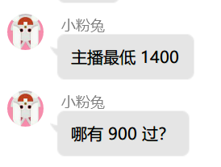

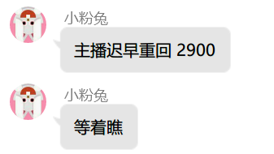

陈亮舟刚正不阿的品格也值得我们称赞，例如当别人想抄他抽代作业的时候，他严词拒绝了

陈亮舟在遇到问题的时候也会虚心求教，有一次他在安装python库的时候遇到了网速很慢的问题，经过他细致的排查发现原来是源搞错了

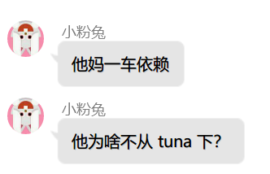

于是陈亮舟开始换源，但仍然没有解决问题。

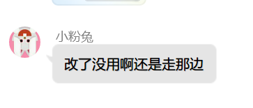

于是经过陈亮舟的仔细排查终于发现了问题

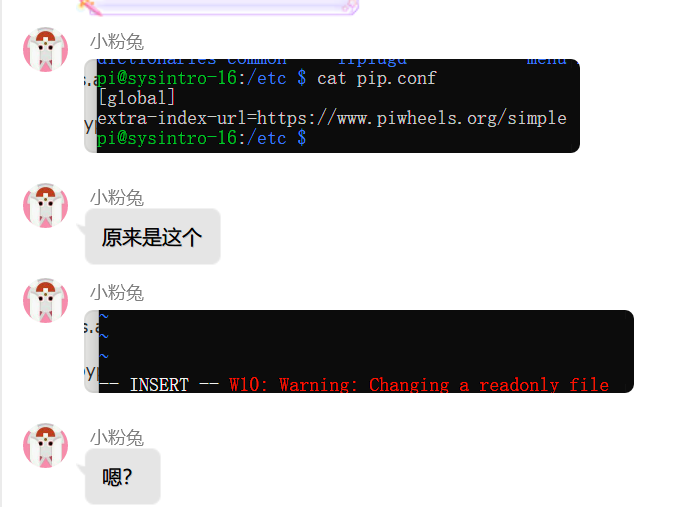

陈亮舟有一个好习惯，他每次失败后都会总结错误原因，这次他总结的原因同样令人深省

在项目成功运行后，由于陈亮舟还要写微积分作业，所以他忽略了警告。这就是陈亮舟节省时间的秘诀

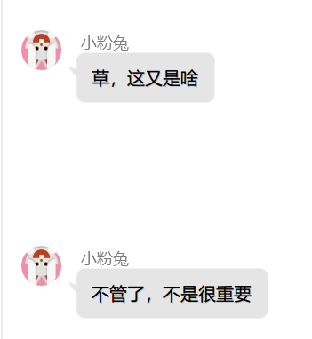

如果你要对大学新生说一句话,你会说什么?”当被问到这个问题,陈亮舟苦笑了一声,摇了摇头说道:“好好学微积分。"”作为“保送生”,陈亮舟和他的大部分集训队同学一样,缺席了一部分高中,甚至初中的课。尽管后来有一定的补习,可对于博学的陈亮舟来说，这里仍是他的一块短板。一次直播时，陈亮舟便展示了如何被八年级·数学·上册·精炼卡住

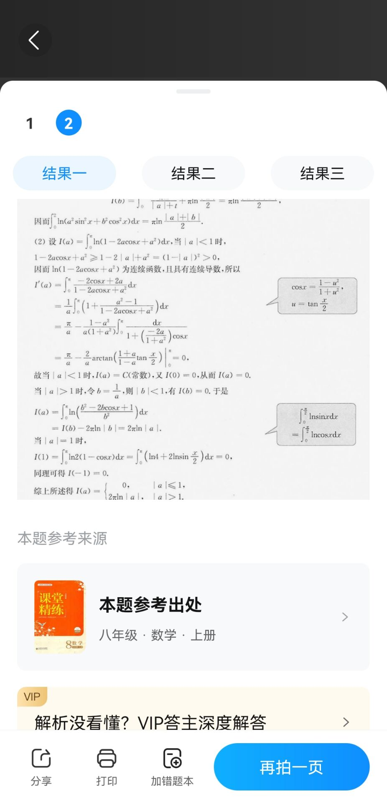

是啊,人非圣贤,岂能无所不知。事实上,陈亮舟对自己的短板也从不避讳。

说到微积分,他有自己的“独门秘诀”,那就是不证一致收敛性。因此,他的作业效率很高,作业经常完成。可他提醒他的同学:“期中考不证一致收敛性是要扣分的。"这是严于律己,宽于律人的陈亮舟。

陈亮舟对权力与统治十分了解，这是他茶余饭后的第一兴趣爱好。

陈亮舟虽然现在已经是清华的牛子，可是他对自己的现状仍不满意，希望进一步提升自己的能力：

陈亮舟还对当代年轻人的发展十分关心。有一次，在小粉兔的建议与引领下，大家在洛谷社区中的发言更加具有针对性了。

当得知记者将记录下他的言行后，陈亮舟说：“你的贡献很大，我以后写自传还得请你来当二作。”确实，分享清华牛子的言行，想必会对后来者有很大的激励吧。就以陈亮舟的一句名言作为本文的结尾吧：

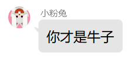

广告：由陈亮舟牵头的比普通Latex快319倍的$ra^B_tEx$现在正式发售，详情请加QQ：3507898808

本文就是使用$ra^B_tEx$撰写并转换的

[rabtex源代码](source.rbt)

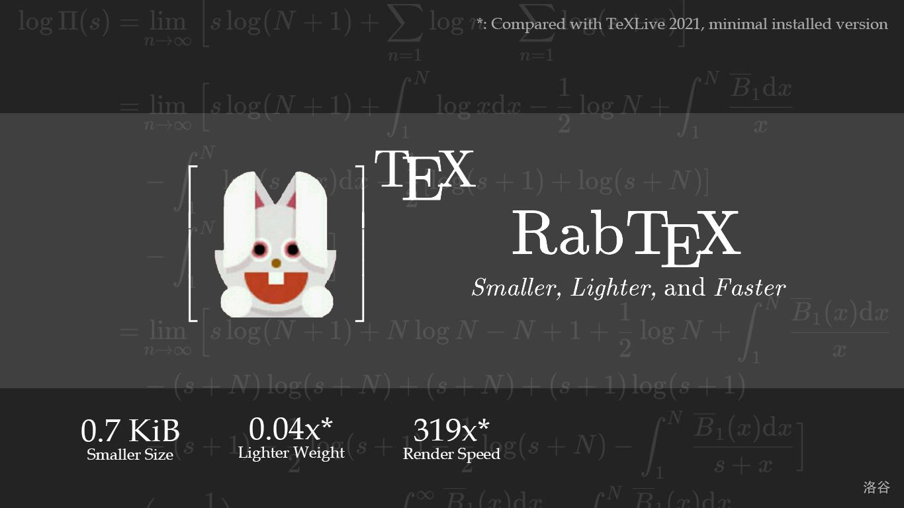

这是陈亮舟对$ra^B_tEx$的评价

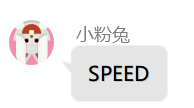

充分展现了陈亮舟对自己产品的自信和把握

[下载地址及使用方式](https://tx0.org/15t)

*来自原作的 PS: 史记结尾写好了。但并没有完结。可以从中间加。*

[github仓库（现已脱离独立更新）](https://github.com/FA555/Records_of_the_Grand_Historian) 

[脑机接口](random.html)

[耻辱柱](./milestone/index.html)

[拼贴诗](./poems/index.html)
